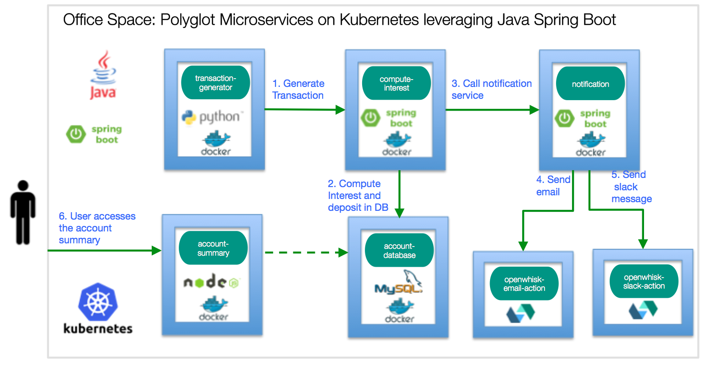
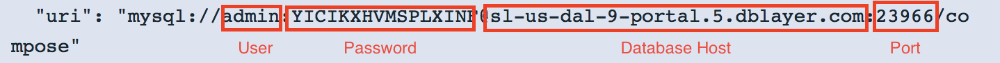
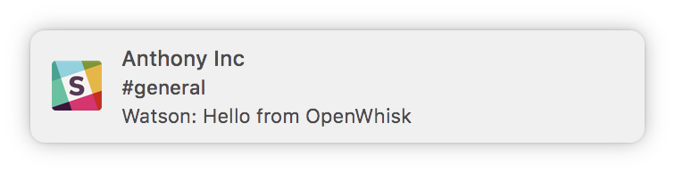
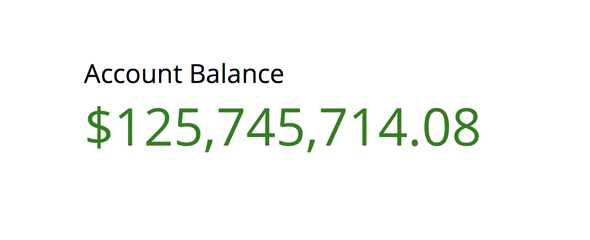

[](https://travis-ci.org/IBM/spring-boot-microservices-on-kubernetes)


# 쿠버네티스에 자바 Spring Boot 애플리케이션 빌드 및 배포하기

*Read this in other languages: [English](README.md).*

Spring Boot은 널리 사용되는 자바 마이크로서비스 프레임워크 입니다. Spring Cloud는 Java 애플리케이션 스택의 일부로 런타임 문제를 해결할 수 있는 풍부한 통합 라이브러리를 갖고 있으며 쿠버네티스는 polyglot 마이크로서비스를 실행할 수 있는 풍부한 기능을 제공합니다. 이 두 기술은 서로를 보완하고 있으며 Spring Boot 애플리케이션을 위한 훌륭한 플랫폼을 만듭니다.

이 코드에서는 쿠버네티스 위에 간단한 Spring Boot 애플리케이션을 배포하는 방법을 보여줍니다.  이 애플리케이션인 Office Space는 영화 [Office Space](http://www.imdb.com/title/tt0151804/)에 등장하는 Michael Bolton의 가상의 앱 아이디어를 모방한 것입니다. 이 앱은 일반적으로 1센트 이하의 금액을 반올림 하는 방식 대신에 버림하여 별도의 은행 계좌에 저장하는 방식으로 이득을 취합니다.

이 애플리케이션은 Java 8/Spring Boot 마이크로서비스를 사용하여 이자를 계산하고 소숫점 이하의 금액은 데이터베이스에 저장합니다. 또 다른 Spring Boot 마이크로서비스인 알림 서비스는 계좌의 잔액이 $50,000 이상이 되면 이메일을 전송합니다. 이는 이자를 계산하는 Spring Boot 웹서버에 의해 트리거 됩니다. 앱의 Frontend는 Node.js 기반으로 만들어졌고 Spring Boot 앱에 의해 쌓인 현재 계좌의 잔액을 보여줍니다. Backend는 MySQL 데이터 베이스를 사용하여 계좌 잔액을 저장합니다.



## 사전 준비 사항

쿠버네티스 클러스터를 생성합니다. 로컬에서 테스트 하려면 [Minikube](https://kubernetes.io/docs/getting-started-guides/minikube)에서, 클라우드에 배포하려면 [IBM Bluemix Container Service](https://github.com/IBM/container-journey-template)에서 생성합니다. 이 코드는 Travis를 사용하여 [Kubernetes Cluster from Bluemix Container Service](https://console.ng.bluemix.net/docs/containers/cs_ov.html#cs_ov)에서 정기적으로 테스트 합니다.

## Steps
1. [데이터베이스 서비스 생성](#1-데이터베이스-서비스-생성)  
1.1 [컨테이너에서 MySQL 사용](#11-컨테이너에서-mysql-사용) 또는  
1.2 [Bluemix MySQL 사용](#12-bluemix-mysql-사용)  
2. [Spring Boot 마이크로서비스 생성](#2-spring-boot-마이크로서비스-생성)  
2.1 [Maven으로 프로젝트 빌드](#21-maven으로-프로젝트-빌드)  
2.2 [닥커 이미지 빌드 및 푸시](#22-닥커-이미지-빌드-및-푸시)  
2.3 [Spring Boot 서비스를 위한 yaml 파일 수정](#23-compute-interest-apiyaml-및-send-notificationyaml-수정)  
&nbsp;&nbsp;&nbsp;&nbsp;&nbsp;&nbsp;2.3.1 [알림 서비스로 기본 이메일 서비스 사용](#231-알림-서비스로-기본-이메일-서비스-사용-gmail) 또는  
&nbsp;&nbsp;&nbsp;&nbsp;&nbsp;&nbsp;2.3.2 [알림 서비스로 OpenWhisk Actions 사용](#232-알림-서비스로-openwhisk-actions-사용)  
2.4 [Spring Boot 마이크로서비스 배포](#24-spring-boot-마이크로서비스-배포)  
3. [Frontend 서비스 작성](#3-frontend-서비스-작성)  
4. [트랜잭션 생성 서비스 작성](#4-트랜잭션-생성-서비스-작성)  
5. [애플리케이션 접근](#5-애플리케이션-접근)

#### [문제 해결](#문제-해결)

# 1. 데이터베이스 서비스 생성

백엔드 시스템은 MySQL 데이터베이스와 Spring Boot 애플리케이션으로 구성되어 있습니다. 각 마이크로서비스는 Deployment와 Service를 갖고 있습니다. Deployment는 각 마이크로서비스에 대해 시작된 Pod를 관리합니다. 서비스는 각 마이크로서비스에 대해 이름으로 dependency를 참조하도록 안정적인 DNS를 생성합니다.

* MySQL 데이터베이스를 생성하는 방법은 두가지가 있습니다.:
  **[컨테이너에서 MySQL 사용](#11-컨테이너에서-mysql-사용)** *또는*
  **[Bluemix MySQL 사용](#12-bluemix-mysql-사용)**

## 1.1 컨테이너에서 MySQL 사용
```bash
$ kubectl create -f account-database.yaml
service "account-database" created
deployment "account-database" created
```

기본 신임 정보는 이미 secrets.yaml에 base64로 인코딩 되어 있습니다.
> base64 인코딩은 신임 정보를 암호화하지는 않으므로 이 정보를 Github에 업로드 하지 마십시오.

```
$ kubectl apply -f secrets.yaml
secret "demo-credentials" created
```

[Step 2](#2-spring-boot-마이크로서비스-생성)에서 계속 진행 하십시오.

## 1.2 Bluemix MySQL 사용
https://console.ng.bluemix.net/catalog/services/compose-for-mysql를 통해 Bluemix에서 Compose for MySQL을 작성하십시오.
Service Credentials로 가서 신임 정보를 확인하십시오. MySQL의 Hostname, port, user 그리고 password가 신임 정보의 url에 있습니다. 다음의 형식으로 되어 있습니다.

이 신임정보를 큐버네티스 클러스터에 Secret으로 적용해야 합니다. 이 값은 반드시 `base64`로 인코딩 되어 있어야 합니다. `./scripts/create-secrets.sh`를 사용하십시오. 신임 정보를 넣도록 입력을 받을 것입니다. 이 스크립트를 통해 신임 정보를 인코딩 하고 클러스터에 Secret으로 적용할 수 있습니다.
```bash
$ ./scripts/create-secrets.sh
Enter MySQL username:
admin
Enter MySQL password:
password
Enter MySQL host:
hostname
Enter MySQL port:
23966
secret "demo-credentials" created
```

_또한 `secrets.yaml` 파일을 수정하여 base64 인코딩된 신임정보를 직접 넣는 방법을 사용할 수 있습니다. 이 경우에는 `kubectl apply -f secrets.yaml` 를 수행하십시오._

[Step 2](#2-spring-boot-마이크로서비스-생성)에서 계속 진행 하십시오.

# 2. Spring Boot 마이크로서비스 생성
[Maven이 설치되어 있어야 합니다.](https://maven.apache.org/index.html).
Spring Boot 애플리케이션들을 수정하려면 Java 프로젝트와 닥커 이미지를 빌드하기 전에 해야 합니다.

Spring Boot 마이크로서비스는 **Compute-Interest-API** 와 **Send-Notification** 입니다.

**Compute-Interest-API**은 MySQL 데이터베이스를 사용하기위해 구성된 Spring Boot 앱입니다. 관련한 구성은 `spring.datasource.*`에 있는 application.properties에 위치해 있습니다.

*compute-interest-api/src/main/resources/application.properties*
```
spring.datasource.url = jdbc:mysql://${MYSQL_DB_HOST}:${MYSQL_DB_PORT}/dockercon2017

# Username과 password
spring.datasource.username = ${MYSQL_DB_USER}
spring.datasource.password = ${MYSQL_DB_PASSWORD}
```

`application.properties`는 MYSQL_DB_* 환경 변수를 사용하기 위해 구성됐습니다. 이는 `compute-interest-api.yaml` 파일에 정의되어 있습니다.
*compute-interest-api.yaml*
```yaml
spec:
  containers:
  - image: anthonyamanse/compute-interest-api:secrets
    imagePullPolicy: Always
    name: compute-interest-api
    env:
      - name: MYSQL_DB_USER
        valueFrom:
          secretKeyRef:
            name: demo-credentials
            key: username
      - name: MYSQL_DB_PASSWORD
        valueFrom:
          secretKeyRef:
            name: demo-credentials
            key: password
      - name: MYSQL_DB_HOST
        valueFrom:
          secretKeyRef:
            name: demo-credentials
            key: host
      - name: MYSQL_DB_PORT
        valueFrom:
          secretKeyRef:
            name: demo-credentials
            key: port
    ports:
    - containerPort: 8080
```

이 YAML 파일은 이미 이전 단계에서 생성한 쿠버네티스 Secret으로부터 값을 얻도록 구성되어 있습니다. 이는 `application.properties`에 있는 Spring Boot 애플리케이션에서 사용될 것입니다.

**Send-Notification** 은 gmail 그리고/또는 Slack을 통해 알림을 줄 수 있도록 구성되어 있습니다. 알림은 MySQL 데이터베이스의 계좌 잔액이 $50,000을 넘었을 때에 한번만 발송됩니다. 기본적으로는 gmail 옵션을 사용합니다. Event driven 기술을 사용할 수도 있습니다. 여기서는 [OpenWhisk](http://openwhisk.org/)를 사용하여 이메일과 슬랙 메세지를 보냅니다. 알림 마이크로서비스로 OpenWhisk를 사용하려면 마이크로서비스 이미지를 빌드 및 배포 하기 전에 [여기](#232-알림-서비스로-openwhisk-actions-사용) 스텝을 따르십시오. 이메일 알림 설정만 사용하려면 그냥 진행하십시오.

## 2.1. Maven으로 프로젝트 빌드

Maven이 Java 프로젝트를 성공적으로 빌드하면, 각 폴더에 제공된 **Dockerfile**로 닥커 이미지를 빌드해야 합니다.
> Note: compute-interest-api는 시뮬레이션 목적으로 나머지 금액에 x100,000을 곱합니다. `src/main/java/officespace/controller/MainController.java`에서 `remainingInterest *= 100000`라인을 수정/제거할 수 있습니다. 또한 잔액이 $50,000을 넘길 때 알림을 전송하도록 되어 있습니다. `if (updatedBalance > 50000 && emailSent == false )` 라인에서 이 숫자를 변경하여 사용하십시오. 변경 사항을 저장하면 이제 프로젝트를 빌드하십시오.

```bash
Go to containers/compute-interest-api
$ mvn package

Go to containers/send-notification
$ mvn package

```
*이 과정에서는 Bluemix 컨테이너 레지스트리를 사용합니다. [닥커 허브](https://docs.docker.com/datacenter/dtr/2.2/guides/user/manage-images/pull-and-push-images)를 사용할 수도 있습니다.*

## 2.2 닥커 이미지 빌드 및 푸시
> Note: Bluemix 컨테이너 레지스트리로 이미지를 푸시합니다.

Bluemix 컨테이너 레지스트리를 사용하려면 먼저 계정을 구성해야 합니다. [이 튜토리얼](https://developer.ibm.com/recipes/tutorials/getting-started-with-private-registry-hosted-by-ibm-bluemix/)을 따르십시오.

[Docker Hub](https://hub.docker.com)를 사용할 수도 있습니다.

```bash
$ docker build -t registry.ng.bluemix.net/<namespace>/compute-interest-api .
$ docker build -t registry.ng.bluemix.net/<namespace>/send-notification .
$ docker push registry.ng.bluemix.net/<namespace>/compute-interest-api
$ docker push registry.ng.bluemix.net/<namespace>/send-notification
```
## 2.3 *compute-interest-api.yaml* 및 *send-notification.yaml* 수정

이미지를 성공적으로 푸시했으면 yaml 파일을 수정하여 푸시한 이미지를 사용하도록 변경합니다.
```yaml
// compute-interest-api.yaml
  spec:
    containers:
    - image: registry.ng.bluemix.net/<namespace>/compute-interest-api # 푸시한 이미지 이름으로 대체하십시오.
```

```yaml
// send-notification.yaml
  spec:
    containers:
    - image: registry.ng.bluemix.net/<namespace>/send-notification # 푸시한 이미지 이름으로 대체하십시오.
```

두가지 타입의 알림이 가능합니다.
[2.3.1 Use default email service](#231-알림-서비스로-기본-이메일-서비스-사용-gmail)
**또는**
[2.3.2 Use OpenWhisk Actions](#232-알림-서비스로-openwhisk-actions-사용).

### 2.3.1 알림 서비스로 기본 이메일 서비스 사용 (gmail)

`send-notification.yaml` 에서 **환경 변수**를 수정하십시오.:
```yaml
    env:
    - name: GMAIL_SENDER_USER
       value: 'username@gmail.com' # 이메일을 전송할 gmail로 변경하십시오.
    - name: GMAIL_SENDER_PASSWORD
       value: 'password' # 위에 입력한 gmail의 패스워드로 변경하십시오.
    - name: EMAIL_RECEIVER
       value: 'sendTo@gmail.com' # 수신자의 이메일 주소로 변경하십시오.
```

이제 [Step 2.4](#24-spring-boot-마이크로서비스-배포)를 진행하십시오.

### 2.3.2 알림 서비스로 OpenWhisk Actions 사용
이 섹션에서 필요한 것들:
* Slack 팀의 [Slack Incoming Webhook](https://api.slack.com/incoming-webhooks).
* [OpenWhisk CLI](https://console.ng.bluemix.net/openwhisk/)를 사용하기 위해 **Bluemix 계정**이 필요합니다.


#### 2.3.2.1 Actions 생성
이 리파지토리의 최상위 디렉토리에는 OpenWhisk Actions를 생성하는데 필요한 코드가 있습니다. 아직 OpenWhisk CLI를 설치하지 않았다면 먼저 [여기](https://console.ng.bluemix.net/openwhisk/)에서 설치하십시오.

`wsk` 명령을 사용해서 OpenWhisk Actions를 새엇ㅇ할 수 있습니다. Action을 생성하는 문법은 `wsk action create < action_name > < source code for action> [add --param for optional Default parameters]` 입니다.

* **Slack 알림**을 보내기 위한 Action 생성
```bash
$ wsk action create sendSlackNotification sendSlack.js --param url https://hooks.slack.com/services/XXXX/YYYY/ZZZZ
Replace the url with your Slack team's incoming webhook url.
```
* **Gmail 알림**을 전송하기 위한 Action 생성
```bash
$ wsk action create sendEmailNotification sendEmail.js
```

#### 2.3.2.2 Actions 테스트

다음을 사용하여 OpenWhisk Actions를 테스트할 수 있습니다.
 `wsk action invoke [action name] [add --param to pass  parameters]`

* 슬랙 알림 호출하기
```bash
$ wsk action invoke sendSlackNotification --param text "Hello from OpenWhisk"
```
* 이메일 알림 호출하기
```bash
$ wsk action invoke sendEmailNotification --param sender [sender's email] --param password [sender's password]--param receiver [receiver's email] --param subject [Email subject] --param text [Email Body]
```
각각의 명령을 통해 슬랙 메세지와 이메일을 받을 수 있습니다.

#### 2.3.2.3 Actions에 대한 REST API 생성
`wsk api create` 명령을 사용하여 REST API 엔드포인트와 생성된 Actions를 맵핑할 수 있습니다. 이 명령을 사용하는 문법은 `wsk api create [base-path] [api-path] [verb (GET PUT POST etc)] [action name]` 입니다.

* **Slack 알림**에 대한 엔드포인트 생성
```bash
$ wsk api create /v1 /slack POST sendSlackNotification
ok: created API /v1/email POST for action /_/sendEmailNotification
https://service.us.apiconnect.ibmcloud.com/gws/apigateway/api/.../v1/slack
```
* **Gmail 알림**에 대한 엔드포인트 생성
```bash
$ wsk api create /v1 /email POST sendEmailNotification
ok: created API /v1/email POST for action /_/sendEmailNotification
https://service.us.apiconnect.ibmcloud.com/gws/apigateway/api/.../v1/email
```

다음 명령으로 생성한 API 목록을 확인할 수 있습니다.:
```bash
$ wsk api list
ok: APIs
Action                                      Verb  API Name  URL
/Anthony.Amanse_dev/sendEmailNotificatio    post       /v1  https://service.us.apiconnect.ibmcloud.com/gws/apigateway/api/.../v1/email
/Anthony.Amanse_dev/testDefault             post       /v1  https://service.us.apiconnect.ibmcloud.com/gws/apigateway/api/.../v1/slack
```

각자의 API URL을 편한 방법으로 기록해 둡니다. 이 URL은 다음 단계에서 다시 사용됩니다.

#### 2.3.2.4 REST API Url 테스트

* **Slack 알림**의 엔드포인트를 테스트 합니다. URL 부분을 각자의 API URL로 대체하십시오.
```bash
$ curl -X POST -d '{ "text": "Hello from OpenWhisk" }' https://service.us.apiconnect.ibmcloud.com/gws/apigateway/api/.../v1/slack
```

* **Gmail 알림**의 엔드포인트를 테스트 합니다. URL 부분을 각자의 API URL로 대체하십시오. **sender, password, receiver, subject** 파라미터의 값을 각자의 값으로 대체하십시오.
```bash
$ curl -X POST -d '{ "text": "Hello from OpenWhisk", "subject": "Email Notification", "sender": "testemail@gmail.com", "password": "passwordOfSender", "receiver": "receiversEmail" }' https://service.us.apiconnect.ibmcloud.com/gws/apigateway/api/.../v1/email
```


#### 2.3.2.5 REST API Url을 yaml 파일에 추가
API가 잘 작동하는 것을 테스트 한 후에는 이 URL을 `send-notification.yaml` file 에 입력합니다.
```yaml
env:
- name: GMAIL_SENDER_USER
  value: 'username@gmail.com' # 발신자의 이메일
- name: GMAIL_SENDER_PASSWORD
  value: 'password' # 발신자 이메일의 password
- name: EMAIL_RECEIVER
  value: 'sendTo@gmail.com' # 수신자의 이메일
- name: OPENWHISK_API_URL_SLACK
  value: 'https://service.us.apiconnect.ibmcloud.com/gws/apigateway/api/.../v1/slack' # Slack 알림의 API 엔드포인트 URL
- name: SLACK_MESSAGE
  value: 'Your balance is over $50,000.00' # 메세지
- name: OPENWHISK_API_URL_EMAIL
  value: 'https://service.us.apiconnect.ibmcloud.com/gws/apigateway/api/.../v1/email' # 이메일 알림의 API 엔드포인트 URL
```


## 2.4 Spring Boot 마이크로서비스 배포
```bash
$ kubectl create -f compute-interest-api.yaml
service "compute-interest-api" created
deployment "compute-interest-api" created
```
```bash
$ kubectl create -f send-notification.yaml
service "send-notification" created
deployment "send-notification" created
```

# 3. Frontend 서비스 작성
UI는 Node.js 앱으로 전체 계좌의 잔액을 보여줍니다.
**블루믹스의 MySQL 데이터베이스를 사용중이면, 환경 변수를 `account-summary.yaml` 파일에 넣어야 합니다. 블루믹스의 MySQL을 사용하지 않는다면 빈 상태로 두십시오. 이는 [Step 1](#1-데이터베이스-서비스-생성)에서 이미 했습니다.**


* *Node.js**기반 Frontend UI 생성:
```bash
$ kubectl create -f account-summary.yaml
service "account-summary" created
deployment "account-summary" created
```

# 4. 트랜잭션 생성 서비스 작성
트랜잭션 생성 서비스는 Python 앱으로 축적된 이자로 랜덤한 트랜잭션 생성합니다.
* 트랜잭션 생성을 위한 **Python** 앱 작성:
```bash
$ kubectl create -f transaction-generator.yaml
service "transaction-generator" created
deployment "transaction-generator" created
```

# 5. 애플리케이션 접근
Cluster IP와 NodePort를 통해 애플리케이션에 퍼블릭 네트워크로 접근할 수 있습니다. NodePort는 **30080**입니다.

* IP 찾기:
```bash
$ bx cs workers <cluster-name>
ID                                                 Public IP        Private IP      Machine Type   State    Status   
kube-dal10-paac005a5fa6c44786b5dfb3ed8728548f-w1   169.47.241.213   10.177.155.13   free           normal   Ready  
```

* account-summary 서비스의 NodePort 찾기:
```bash
$ kubectl get svc
NAME                    CLUSTER-IP     EXTERNAL-IP   PORT(S)                                                                      AGE
...
account-summary         10.10.10.74    <nodes>       80:30080/TCP                                                                 2d
...
```
* 브라우저에서, `http://<your-cluster-IP>:30080`에 접속하십시오.


## 문제 해결
* 다시 시작하려면 모두 삭제하십시오. `kubectl delete svc,deploy -l app=office-space`


## 참조
* [John Zaccone](https://github.com/jzaccone) - [office space app deployed via Docker](https://github.com/jzaccone/office-space-dockercon2017)의 원 저자.
* Office Space 앱은 1999년도 영화 Office Space의 컨셉에 기반했습니다.

## 라이센스
[Apache 2.0](http://www.apache.org/licenses/LICENSE-2.0)

# 정보 사용 안내

이 패키지가 포함 된 샘플 쿠버네티스 Yaml 파일은 [IBM Cloud](https://www.bluemix.net/) 및 기타 쿠버네티스 플랫폼에 대한 배치를 추적하도록 구성 될 수 있습니다. 다음 정보는 배포시마다 [배치 추적 서비스](https://github.com/IBM/metrics-collector-service)로 전송됩니다.:

* 쿠버네티스 클러스터 제공자 (`Bluemix,Minikube 등`)
* 쿠버네티스 Machine ID (`MachineID`)
* 이 쿠버네티스 Job의 환경 변수

이 데이터는 샘플 애플리케이션의 yaml 파일의 쿠버네티스 Job으로부터 수집됩니다. 이 데이터는 IBM에서 지속적으로 더 나은 컨텐츠를 제공하기 위해 사용됩니다. 예제의 유용성을 측정하기 위해 IBM Cloud로 배포되는 샘플 애플리케이션의 배포를 관련된 측정 항목을 추적하는데에 사용합니다.배포 추적 서비스를 핑하는 코드가 포함 된 샘플 응용 프로그램의 배포 만 추적됩니다.

## 배포 추적 비활성화

`account-summary.yaml` 파일의 끝 부분에 있는 쿠버네티스 Job 부분을 주석 처리 하거나 삭제하십시오.