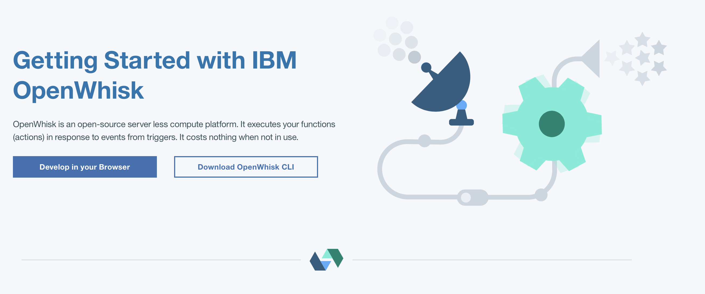
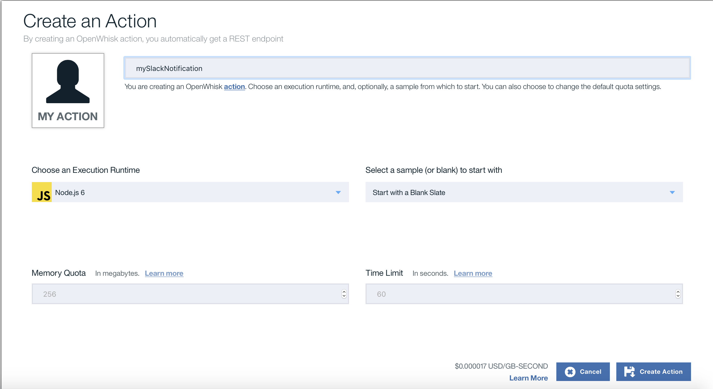
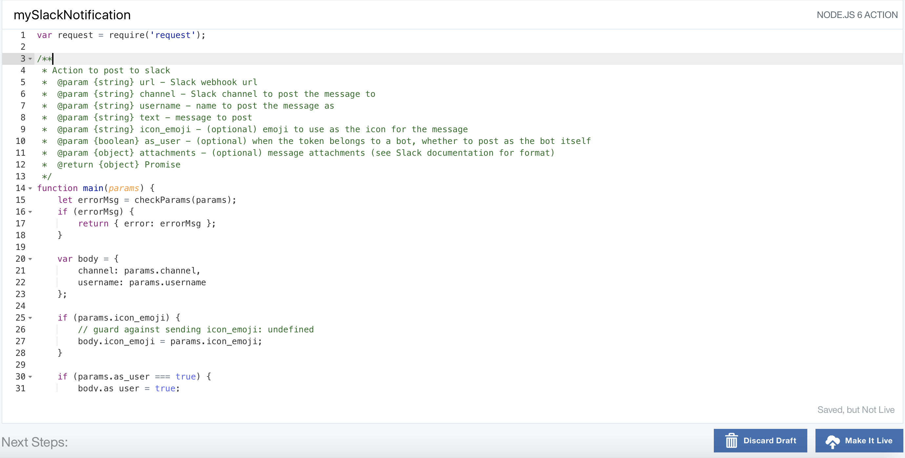
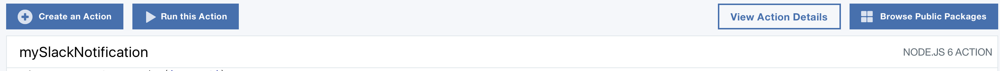
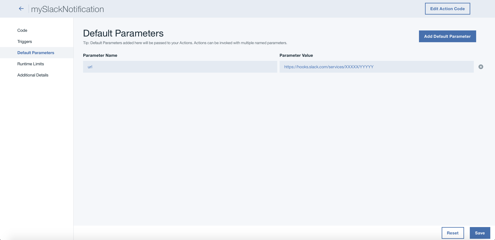
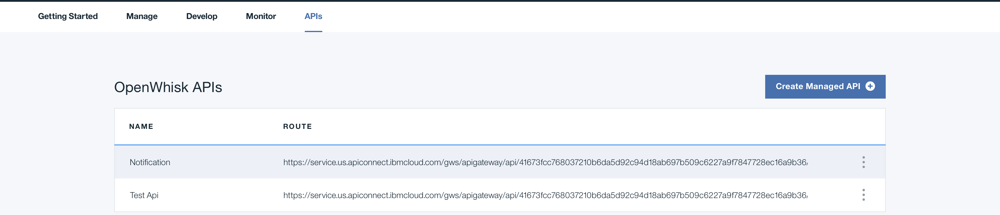
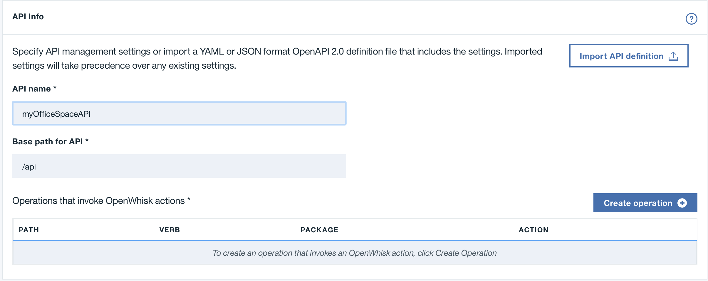
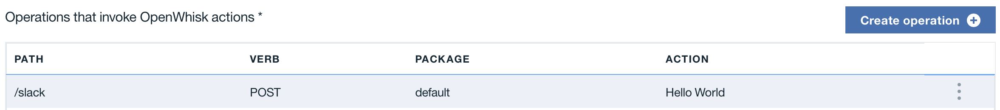
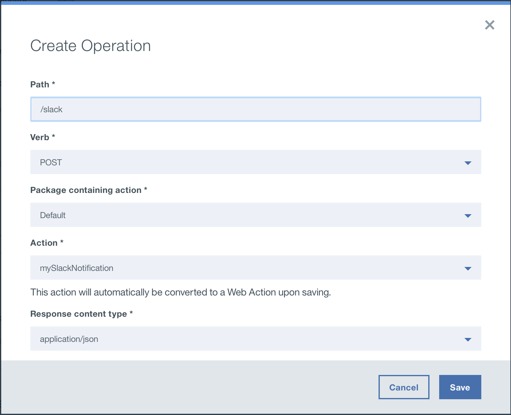
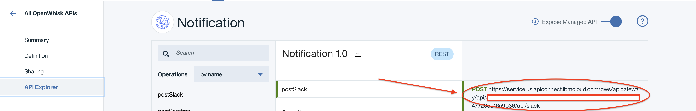

[](https://travis-ci.org/IBM/office-space)
# OfficeSpace: Polyglot Microservices application leveraging Java Spring Boot on Kubernetes

Spring Boot is one of the popular Java microservices framework. Spring Cloud has a rich set of well integrated Java libraries to address runtime concerns as part of the Java application stack, and Kubernetes provides a rich featureset to run polyglot microservices. Together these technologies complement each other and make a great platform for Spring Boot applications.

In this code we demonstrate how a simple Spring Boot application can be deployed on top of Kuberneets. This application, Office Space, mimicks the fictitious app idea from Michael Bolton in the movie [Office Space](http://www.imdb.com/title/tt0151804/). The app takes advantage of a financial program that computes interest for transactions by diverting fractions of a cent that are usually rounded off into a seperate bank account.

The application uses a Java 8/Spring Boot microservice that computes the interest then takes the fraction of the pennies to a database. Another Spring Boot microservice is the notification service. It sends email when the account balance reach more than $50,000. It is triggered by the Spring Boot webserver that computes the interest. The frontend uses a Node.js app that shows the current account balance accumulated by the Spring Boot app. The backend uses a MySQL database to store the account balance.


## Prerequisite

Create a Kubernetes cluster with either [Minikube](https://kubernetes.io/docs/getting-started-guides/minikube) for local testing, or with [IBM Bluemix Container Service](https://github.com/IBM/container-journey-template) to deploy in cloud. The code here is regularly tested against [Kubernetes Cluster from Bluemix Container Service](https://console.ng.bluemix.net/docs/containers/cs_ov.html#cs_ov) using Travis.

## Deploy to Bluemix
If you want to deploy the Office Space app directly to Bluemix, click on 'Deploy to Bluemix' button below to create a Bluemix DevOps service toolchain and pipeline for deploying the sample, else jump to [Steps](#steps)

> You will need to create your Kubernetes cluster first and make sure it is fully deployed in your Bluemix account.

[](https://console.ng.bluemix.net/devops/setup/deploy/?repository=https://github.com/IBM/office-space)

Please follow the [Toolchain instructions](https://github.com/IBM/container-journey-template/blob/master/Toolchain_Instructions.md) to complete your toolchain and pipeline.

## Steps
1. [Create the Database service](#1-create-the-database-service)
	- 1.1 [Use MySQL in container](#11-use-mysql-in-container) or
	- 1.2 [Use Bluemix MySQL](#12-use-bluemix-mysql)
2. [Create the Spring Boot Microservices](#2-create-the-spring-boot-microservices)
      - 2.1 [Use OpenWhisk action with Spring Boot Notification Service](#21-use-openwhisk-action-with-spring-boot-notificatoin-service)
3. [Create the Frontend service](#3-create-the-frontend-service)
4. [Create the Transaction Generator service](#4-create-the-transaction-generator-service)
5. [Access Your Application](#5-access-your-application)

#### [Troubleshooting](#troubleshooting-1)

# 1. Create the Database service
The backend consists of the MySQL database and the Spring Boot app. You will also be creating a deployment controller for each to provision their Pods.

* There are two ways to create the MySQL database backend: **Use MySQL in a container in your cluster** *OR* **Use Bluemix MySQL**

## 1.1 Use MySQL in container
**NOTE:** Leave the environment variables blank in the `compute-interest-api.yaml` and `account-summary.yaml`
```bash
$ kubectl create -f account-database.yaml
service "account-database" created
deployment "account-database" created
```

## 1.2 Use Bluemix MySQL
  Provision Compose for MySQL in Bluemix via https://console.ng.bluemix.net/catalog/services/compose-for-mysql
  Go to Service credentials and view your credentials. Your MySQL hostname, port, user, and password are under your credential uri and it should look like this
  
	You will need to modify **both** `compute-interest-api.yaml` and `account-summary.yaml` files. You need to modify their environment variables to use your MySQL database in Bluemix:
  ```yaml
  // compute-interest-api.yaml AND account-summary.yaml
  env:
      - name: OFFICESPACE_MYSQL_DB_USER
        value: '<your-username>'
      - name: OFFICESPACE_MYSQL_DB_PASSWORD
        value: '<Your-database-password>'
      - name: OFFICESPACE_MYSQL_DB_HOST
        value: '<Your-database-host>'
      - name: OFFICESPACE_MYSQL_DB_PORT
        value: '<your-port-number>'
  ```
  **IMPORTANT:** You will also need to put in `'bluemix'` in the environment `MYSQL_ENVIRONMENT` of compute-interest-api.yaml. This would make the **Spring Boot app of compute-interest-api** to select the right configuration for bluemix
  ```yaml
  // compute-interest-api.yaml
      - name: MYSQL_ENVIRONMENT
        value: 'bluemix'
  ```

# 2. Create the Spring Boot Microservices
You will need to have [Maven installed on your environment](https://maven.apache.org/index.html).
If you want to modify the Spring Boot apps, you will need to do it before building the Java project and the docker image.

The Spring Boot Microservices are the **Compute-Interest-API** and the **Send-Notification**.

The **Send-Notification** can be configured to send notification through gmail and/or Slack. Default is the gmail option. You can also use event driven technology, in this case [OpenWhisk](http://openwhisk.org/) to send emails and slack messages. To use OpenWhisk with your notification microservice, please follow the steps [here](#using-openwhisk-action-with-slack-notification) before building and deploying the microservice images. Otherwise, you can proceed if you choose to only have an email notification setup.

* 1. Build the images

	After Maven has successfully built the Java project, you will need to build the Docker image using the provided **Dockerfile** in their respective folders.
	```bash
	Go to containers/compute-interest-api
	$ mvn package
	$ docker build -t registry.ng.bluemix.net/<namespace>/compute-interest-api .

	Go to containers/email-office-space
	$ mvn package
	$ docker build -t registry.ng.bluemix.net/<namespace>/send-notification .
	```
	 *We will be using Bluemix container registry to push images (hence the image naming), but the images [can be pushed in Docker hub](https://docs.docker.com/datacenter/dtr/2.2/guides/user/manage-images/pull-and-push-images) as well.*
* 2. Push the images:
	> Note: This is being pushed in the Bluemix Container Registry.

	If you plan to use Bluemix Container Registry, you will need to setup your account first. Follow the tutorial [here](https://developer.ibm.com/recipes/tutorials/getting-started-with-private-registry-hosted-by-ibm-bluemix/).

	You can also push it in [Docker Hub](https://hub.docker.com).

	```bash
	$ docker push registry.ng.bluemix.net/<namespace>/compute-interest-api
	$ docker push registry.ng.bluemix.net/<namespace>/send-notification
	```
* 3. Modify `compute-interest-api.yaml` and `send-notification.yaml` to use your image
	```yaml
  // compute-interest-api.yaml
    spec:
      containers:
      - image: registry.ng.bluemix.net/<namespace>/compute-interest-api # replace with your image name
  ```
  
  ```yaml
  // send-notification.yaml
    spec:
      containers:
      - image: registry.ng.bluemix.net/<namespace>/send-notification # replace with your image name
  ```
  
	You will also need to modify the **environment variables** in the `send-notification.yaml`:
	```yaml
    env:
    - name: GMAIL_SENDER_USER
       value: 'username@gmail.com' # change this to the gmail that will send the email
    - name: GMAIL_SENDER_PASSWORD
       value: 'password' # change this to the the password of the gmail above
    - name: EMAIL_RECEIVER
       value: 'sendTo@gmail.com' # change this to the email of the receiver
	```
* 4. Deploy the Spring Boot Microservices
	```bash
	$ kubectl create -f compute-interest-api.yaml
	service "compute-interest-api" created
	deployment "compute-interest-api" created
	```
	```bash
	$ kubectl create -f send-notification.yaml
	service "send-notification" created
	deployment "send-notification" created
	```
	> Note: The compute-interest-api multiplies the fraction of the pennies to x100,000 for simulation purposes. You can edit/remove the line `remainingInterest *= 100000` in `src/main/java/officespace/controller/MainController.java` then build the image again.

To use OpenWhisk with your notification microservice for email and slack messages, follow the step below, or jump to [step 3 to create the Node.js frontend](#3-create-the-frontend-service)

### 21 Use OpenWhisk Action with Spring Boot Notification service

Requirements for this sections:
* [Slack Incoming Webhook](https://api.slack.com/incoming-webhooks) in your Slack team.
* **Bluemix Account** to use [OpenWhisk](https://console.ng.bluemix.net/openwhisk/).


1. Create an OpenWhisk Action
	* Click on [Developer in your Browser](https://console.ng.bluemix.net/openwhisk/) and click on **Create an Action**
	

	* Then click on
	

		
	* Copy the [sendSlack.js](/sendSlack.js) for sending a Slack Notification then save it
	
	* Set your [Slack Webhook URL](https://api.slack.com/incoming-webhooks) as default parameter for the action then save it
	Click on View Action Details
	
	Then set `url` to `https://< Your Slack Team's incoming webhook url>`
	
	* Create another action for [sendEmail.js](/sendEmail.js) for sending an email through Gmail.

2. Create Managed API
	* From the API tab, Create Managed API
	

	* Then set an API name
	
	* Create an operation. Make it a **POST request** and **select the Slack Action** you just created. **Do the same fore the Email Action**.
	

		
	* Go to the API Explorer section on your managed API and take note of the URL for both **Slack** and **Email** operations.
	
3. Modify `send-notification.yaml`
	* Fill in the necessary values on the environment variables
	```yaml
	- name: OPENWHISK_API_URL_SLACK
	  value: 'openwhisk api url for slack action' # enter the url of the API you just created
	- name: SLACK_MESSAGE
	  value: 'Your balance is over $50,000.00' # set the slack message
	- name: OPENWHISK_API_URL_EMAIL
	  value: 'openwhisk api url for email action'
	```
# 3. Create the Frontend service
The UI is a Node.js app that shows the total account balance.
**If you are using a MySQL database in Bluemix, don't forget to fill in the values of the environment variables in `account-summary.yaml` file, otherwise leave them blank. This was done in [Step 1](#1-create-the-database-service).**


* Create the **Node.js** frontend:
```bash
$ kubectl create -f account-summary.yaml
service "account-summary" created
deployment "account-summary" created
```

# 4. Create the Transaction Generator service
The transaction generator is a Python app that generates random transactions with accumulated interest.
* Create the transaction generator **Python** app:
```bash
$ kubectl create -f transaction-generator.yaml
service "transaction-generator" created
deployment "transaction-generator" created
```

# 5. Access Your Application
You can access your app publicly through your Cluster IP and the NodePort. The NodePort should be **30080**.

* To find your IP:
```bash
$ kubectl get nodes
NAME             STATUS    AGE
169.47.241.213   Ready     7d
---OR---
$ bx cs workers <cluster-name>
ID                                                 Public IP        Private IP      Machine Type   State    Status   
kube-dal10-paac005a5fa6c44786b5dfb3ed8728548f-w1   169.47.241.213   10.177.155.13   free           normal   Ready  
```

* To find the NodePort of the account-summary service:
```bash
$ kubectl get svc
NAME                    CLUSTER-IP     EXTERNAL-IP   PORT(S)                                                                      AGE
...
account-summary         10.10.10.74    <nodes>       80:30080/TCP                                                                 2d
...
```
* On your browser, go to `http://<your-cluster-IP>:30080`


## Troubleshooting
* To start over, delete everything: `kubectl delete svc,deploy -l app=office-space`


## References
* [John Zaccone](https://github.com/jzaccone) - The original author of the [office space app deployed via Docker](https://github.com/jzaccone/office-space-dockercon2017).
* The Office Space app is based on the 1999 film that used that concept.

## License
[Apache 2.0](http://www.apache.org/licenses/LICENSE-2.0)
