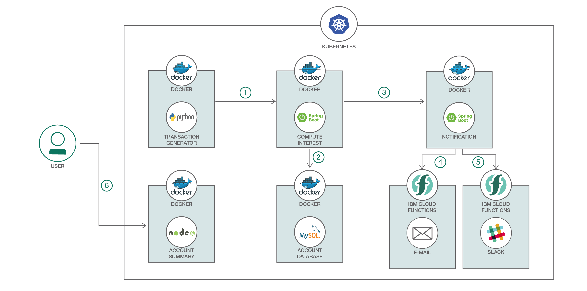

[](https://travis-ci.org/IBM/spring-boot-microservices-on-kubernetes)

# Build and deploy Java Spring Boot microservices on Kubernetes

*Read this in other languages: [한국어](README-ko.md)、[中国](README-cn.md).*

Spring Boot is one of the popular Java microservices framework. Spring Cloud has a rich set of well integrated Java libraries to address runtime concerns as part of the Java application stack, and Kubernetes provides a rich featureset to run polyglot microservices. Together these technologies complement each other and make a great platform for Spring Boot applications.

In this code we demonstrate how a simple Spring Boot application can be deployed on top of Kubernetes. This application, Office Space, mimicks the fictitious app idea from Michael Bolton in the movie [Office Space](http://www.imdb.com/title/tt0151804/). The app takes advantage of a financial program that computes interest for transactions by diverting fractions of a cent that are usually rounded off into a seperate bank account.

The application uses a Java 8/Spring Boot microservice that computes the interest then takes the fraction of the pennies to a database. Another Spring Boot microservice is the notification service. It sends email when the account balance reach more than $50,000. It is triggered by the Spring Boot webserver that computes the interest. The frontend uses a Node.js app that shows the current account balance accumulated by the Spring Boot app. The backend uses a MySQL database to store the account balance.

## Flow



1. The Transaction Generator service written in Python simulates transactions and pushes them to the Compute Interest microservice.
2. The Compute Interest microservice computes the interest and then moves the fraction of pennies to the MySQL database to be stored. The database can be running within a container in the same deployment or on a public cloud such as IBM Cloud.
3. The Compute Interest microservice then calls the notification service to notify the user if an amount has been deposited in the user’s account.
4. The Notification service uses IBM Cloud Function to send an email message to the user.
5. Additionally, an IBM Cloud Function to send messages to Slack can also be invoked.
6. The user retrieves the account balance by visiting the Node.js web interface.

## Included Components

* [IBM Cloud Kubernetes Service](https://console.bluemix.net/docs/containers/container_index.html): IBM Bluemix Container Service manages highly available apps inside Docker containers and Kubernetes clusters on the IBM Cloud.
* [Compose for MySQL](https://console.ng.bluemix.net/catalog/services/compose-for-mysql): Probably the most popular open source relational database in the world.
* [IBM Cloud Functions](https://console.ng.bluemix.net/openwhisk): Execute code on demand in a highly scalable, serverless environment.

## Featured Technologies

* [Container Orchestration](https://www.ibm.com/cloud/container-service): Automating the deployment, scaling and management of containerized applications.
* [Databases](https://en.wikipedia.org/wiki/IBM_Information_Management_System#.22Full_Function.22_databases): Repository for storing and managing collections of data.
* [Serverless](https://www.ibm.com/cloud/functions): An event-action platform that allows you to execute code in response to an event.

# Prerequisite

* Create a Kubernetes cluster with either [Minikube](https://kubernetes.io/docs/getting-started-guides/minikube) for local testing, [IBM Cloud Private](https://github.com/IBM/Kubernetes-container-service-GitLab-sample/blob/master/docs/deploy-with-ICP.md), or with [IBM Cloud Kubernetes Service](https://github.com/IBM/container-journey-template) to deploy in cloud. The code here is regularly tested against [Kubernetes Cluster from IBM Cloud](https://console.ng.bluemix.net/docs/containers/cs_ov.html#cs_ov) using Travis.

* [Slack Incoming Webhook](https://api.slack.com/incoming-webhooks) in your Slack team. _(If you want to receive a test notification in Step 4.)_

* [IBM Cloud Function CLI](https://console.bluemix.net/openwhisk/learn/cli/) to create IBM Cloud Functions. _(If you want to do Step 4.)_


# Steps
1. [Clone the repo](#1-clone-the-repo)
2. [Create the Database service](#2-create-the-database-service)
3. [Create the Spring Boot Microservices](#3-create-the-spring-boot-microservices)
4. [Use IBM Cloud Functions with Notification service *(Optional)*](#4-use-ibm-cloud-functions-with-notification-service)
5. [Deploy the Microservices](#5-deploy-the-microservices)
6. [Access Your Application](#6-access-your-application)

### 1. Clone the repo

Clone this repository. In a terminal, run:

```
$ git clone https://github.com/IBM/spring-boot-microservices-on-kubernetes
```

### 2. Create the Database service

The backend consists of a MySQL database and the Spring Boot app. Each
microservice has a Deployment and a Service. The deployment manages
the pods started for each microservice. The Service creates a stable
DNS entry for each microservice so they can reference their
dependencies by name.

* There are two ways to create the MySQL database backend:
  **Use MySQL in container** *OR*
  **Use IBM Cloud Compose for MySQL**

* Use MySQL in container _(Option 1)_

```bash
$ kubectl create -f account-database.yaml
service "account-database" created
deployment "account-database" created
```
Default credentials are already encoded in base64 in secrets.yaml.
> Encoding in base64 does not encrypt or hide your secrets. Do not put this in your Github.

```
$ kubectl apply -f secrets.yaml
secret "demo-credentials" created
```

Continue on in [Step 3](#3-create-the-spring-boot-microservices).

* Use IBM Cloud Compose for MySQL _(Option 2)_

Provision [IBM Cloud Compose for MySQL](https://console.ng.bluemix.net/catalog/services/compose-for-mysql). Go to Service credentials and view your credentials. Your MySQL hostname, port, user, and password are under your credential uri and it should look like this

You will need to apply these credentials as a Secret in your Kubernetes cluster. It should be `base64` encoded.
Use the script `./scripts/create-secrets.sh`. You will be prompted to enter your credentials. This will encode the credentials you input and apply them in your cluster as Secrets.

```bash
$ ./scripts/create-secrets.sh
Enter MySQL username:
admin
Enter MySQL password:
password
Enter MySQL host:
hostname
Enter MySQL port:
23966
secret "demo-credentials" created
```

_You can also use the `secrets.yaml` file and edit the data values in it to your own base64 encoded credentials. Then do `kubectl apply -f secrets.yaml`._

### 3. Create the Spring Boot Microservices
You will need to have [Maven installed in your environment](https://maven.apache.org/index.html).
If you want to modify the Spring Boot apps, you will need to do it before building the Java project and the docker image.

The Spring Boot Microservices are the **Compute-Interest-API** and the **Send-Notification**.

**Compute-Interest-API** is a Spring Boot app configured to use a MySQL database. The configuration is located in `compute-interest-api/src/main/resources/application.properties` in `spring.datasource.*`

The `application.properties` is configured to use MYSQL_DB_* environment variables. These are defined in the `compute-interest-api.yaml` file. It is already configured to get the values from the Kubernetes Secrets that was created earlier.

The **Send-Notification** can be configured to send notification through gmail and/or Slack. The notification is sent when the account balance on the MySQL database goes over $50,000.

* Build your projects using Maven

After Maven has successfully built the Java project, you will need to build the Docker image using the provided `Dockerfile` in their respective folders.
> Note: The compute-interest-api multiplies the fraction of the pennies to x100,000 for simulation purposes.

```bash
Go to containers/compute-interest-api
$ mvn package

Go to containers/send-notification
$ mvn package

```

* Build your Docker images for Spring Boot services
> Note: This is being pushed in the IBM Cloud Container Registry.

If you plan to use IBM Cloud Container Registry, you will need to setup your account first. Follow the tutorial [here](https://developer.ibm.com/recipes/tutorials/getting-started-with-private-registry-hosted-by-ibm-bluemix/).

*We will be using IBM Cloud container registry to push images (hence the image naming), but the images [can be pushed in Docker hub](https://docs.docker.com/datacenter/dtr/2.2/guides/user/manage-images/pull-and-push-images) as well.*

```bash
$ docker build -t registry.ng.bluemix.net/<YOUR_NAMESPACE>/compute-interest-api .
$ docker build -t registry.ng.bluemix.net/<YOUR_NAMESPACE>/send-notification .
$ docker push registry.ng.bluemix.net/<YOUR_NAMESPACE>/compute-interest-api
$ docker push registry.ng.bluemix.net/<YOUR_NAMESPACE>/send-notification
```

* Modify *compute-interest-api.yaml* and *send-notification.yaml* to use your image

Once you have successfully pushed your images, you will need to modify the yaml files to use your images.
```yaml
# compute-interest-api.yaml
  spec:
    containers:
      - image: registry.ng.bluemix.net/<namespace>/compute-interest-api # replace with your image name
```

```yaml
# send-notification.yaml
  spec:
    containers:
      - image: registry.ng.bluemix.net/<namespace>/send-notification # replace with your image name
```

There are two types of notifications possible, either `Using default email service with Notification service` or `Use IBM Cloud Functions with Notification Service`

* Using default email service (gmail) with Notification service

You will need to modify the **environment variables** in the `send-notification.yaml`:
```yaml
    env:
    - name: GMAIL_SENDER_USER
       value: 'username@gmail.com' # change this to the gmail that will send the email
    - name: GMAIL_SENDER_PASSWORD
       value: 'password' # change this to the the password of the gmail above
    - name: EMAIL_RECEIVER
       value: 'sendTo@gmail.com' # change this to the email of the receiver
```

You may now proceed to [Step 5](#5-deploy-the-microservices) if you don't want to use IBM Cloud Functions.

### 4. Use IBM Cloud Functions with Notification service
> This is an optional step if you want to try IBM Cloud Functions

* Create Actions
The root directory of this repository contains the required code for you to create IBM Cloud Functions. You can create Actions using the `ibmcloud wsk` or `wsk` command.

Create action for sending **Slack Notification**
```bash
$ wsk action create sendSlackNotification sendSlack.js --param url https://hooks.slack.com/services/XXXX/YYYY/ZZZZ --web true
# Replace the url with your Slack team's incoming webhook url.
```

Create action for sending **Gmail Notification**
```bash
$ wsk action create sendEmailNotification sendEmail.js --web true
```

* Test Actions

You can test your IBM Cloud Function Actions using `wsk action invoke [action name] [add --param to pass  parameters]`

Invoke Slack Notification
```bash
$ wsk action invoke sendSlackNotification --param text "Hello from OpenWhisk"
```

Invoke Email Notification
```bash
$ wsk action invoke sendEmailNotification --param sender [sender email] --param password [sender password]--param receiver [receiver email] --param subject [Email subject] --param text [Email Body]
```
You should receive a slack message and receive an email respectively.

* Create REST API for Actions

You can map REST API endpoints for your created actions using `wsk api create`. The syntax for it is `wsk api create [base-path] [api-path] [verb (GET PUT POST etc)] [action name]`

Create endpoint for **Slack Notification**

```bash
$ wsk api create /v1 /slack POST sendSlackNotification

ok: created API /v1/slack POST for action /_/sendEmailNotification
https://service.us.apiconnect.ibmcloud.com/gws/apigateway/api/.../v1/slack
```

Create endpoint for **Gmail Notification**
```bash
$ wsk api create /v1 /email POST sendEmailNotification
ok: created API /v1/email POST for action /_/sendEmailNotification
https://service.us.apiconnect.ibmcloud.com/gws/apigateway/api/.../v1/email
```

You can view a list of your APIs with this command:

```bash
$ wsk api list

ok: APIs
Action                                      Verb  API Name  URL
/Anthony.Amanse_dev/sendEmailNotificatio    post       /v1  https://service.us.apiconnect.ibmcloud.com/gws/apigateway/api/.../v1/email
/Anthony.Amanse_dev/testDefault             post       /v1  https://service.us.apiconnect.ibmcloud.com/gws/apigateway/api/.../v1/slack
```

Take note of your API URLs. You are going to use them later.

* Test REST API Url

Test endpoint for **Slack Notification**. Replace the URL with your own API URL.

```bash
$ curl -X POST -H 'Content-type: application/json' -d '{ "text": "Hello from OpenWhisk" }' https://service.us.apiconnect.ibmcloud.com/gws/apigateway/api/.../v1/slack
```


Test endpoint for **Gmail Notification**. Replace the URL with your own API URL. Replace the value of the parameters **sender, password, receiver, subject** with your own.

```bash
$ curl -X POST -H 'Content-type: application/json' -d '{ "text": "Hello from OpenWhisk", "subject": "Email Notification", "sender": "testemail@gmail.com", "password": "passwordOfSender", "receiver": "receiversEmail" }' https://service.us.apiconnect.ibmcloud.com/gws/apigateway/api/.../v1/email
```


* Add REST API Url to yaml files

Once you have confirmed that your APIs are working, put the URLs in your `send-notification.yaml` file
```yaml
env:
- name: GMAIL_SENDER_USER
  value: 'username@gmail.com' # the sender's email
- name: GMAIL_SENDER_PASSWORD
  value: 'password' # the sender's password
- name: EMAIL_RECEIVER
  value: 'sendTo@gmail.com' # the receiver's email
- name: OPENWHISK_API_URL_SLACK
  value: 'https://service.us.apiconnect.ibmcloud.com/gws/apigateway/api/.../v1/slack' # your API endpoint for slack notifications
- name: SLACK_MESSAGE
  value: 'Your balance is over $50,000.00' # your custom message
- name: OPENWHISK_API_URL_EMAIL
  value: 'https://service.us.apiconnect.ibmcloud.com/gws/apigateway/api/.../v1/email' # your API endpoint for email notifications
```

### 5. Deploy the Microservices

* Deploy Spring Boot Microservices

```bash
$ kubectl apply -f compute-interest-api.yaml
service "compute-interest-api" created
deployment "compute-interest-api" created
```

```bash
$ kubectl apply -f send-notification.yaml
service "send-notification" created
deployment "send-notification" created
```

* Deploy the Frontend service

The UI is a Node.js app serving static files (HTML, CSS, JavaScript) that shows the total account balance.

```bash
$ kubectl apply -f account-summary.yaml
service "account-summary" created
deployment "account-summary" created
```

* Deploy the Transaction Generator service
The transaction generator is a Python app that generates random transactions with accumulated interest.

Create the transaction generator **Python** app:
```bash
$ kubectl apply -f transaction-generator.yaml
service "transaction-generator" created
deployment "transaction-generator" created
```

### 6. Access Your Application
You can access your app publicly through your Cluster IP and the NodePort. The NodePort should be **30080**.

* To find your IP:
```bash
$ ibmcloud cs workers <cluster-name>
ID                                                 Public IP        Private IP      Machine Type   State    Status   
kube-dal10-paac005a5fa6c44786b5dfb3ed8728548f-w1   169.47.241.213   10.177.155.13   free           normal   Ready  
```

* To find the NodePort of the account-summary service:
```bash
$ kubectl get svc
NAME                    CLUSTER-IP     EXTERNAL-IP   PORT(S)                                                                      AGE
...
account-summary         10.10.10.74    <nodes>       80:30080/TCP                                                                 2d
...
```
* On your browser, go to `http://<your-cluster-IP>:30080`


## Troubleshooting
* To start over, delete everything: `kubectl delete svc,deploy -l app=office-space`


## References
* [John Zaccone](https://github.com/jzaccone) - The original author of the [office space app deployed via Docker](https://github.com/jzaccone/office-space-dockercon2017).
* The Office Space app is based on the 1999 film that used that concept.

## License
This code pattern is licensed under the Apache Software License, Version 2.  Separate third party code objects invoked within this code pattern are licensed by their respective providers pursuant to their own separate licenses. Contributions are subject to the [Developer Certificate of Origin, Version 1.1 (DCO)](https://developercertificate.org/) and the [Apache Software License, Version 2](http://www.apache.org/licenses/LICENSE-2.0.txt).

[Apache Software License (ASL) FAQ](http://www.apache.org/foundation/license-faq.html#WhatDoesItMEAN)
